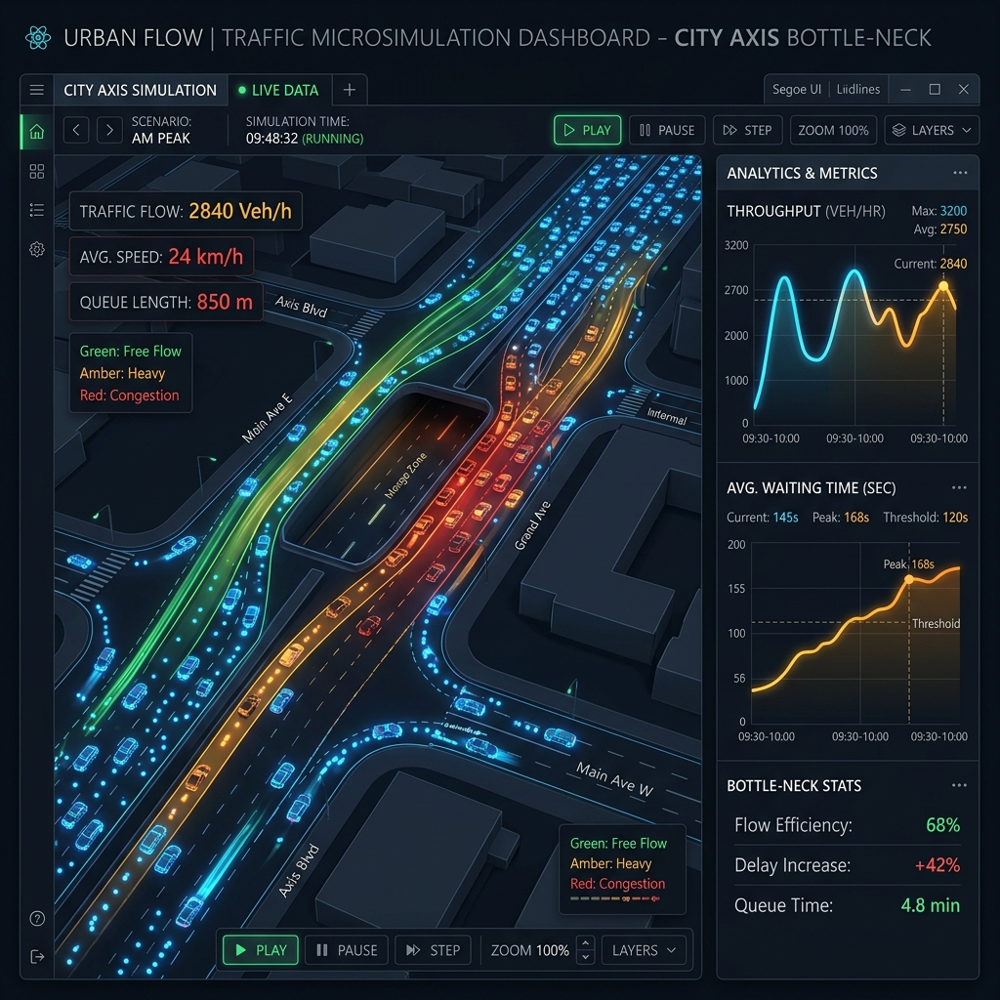

# 🌊 FlowState

**Architectural Blueprint, Technology Stack, and Execution Strategy for Agentic Urban Traffic Microsimulation**

 

---

## 🎯 Challenge Alignment: KnowledgeQuarry
**CONVOKE 8.0 | Data Science Challenge | PROBLEM_01: The Bottleneck Problem**  
**Track:** ML Engineering Track 

This project directly answers the challenge to design a data-driven system modeling traffic flow at a bottleneck. We chose **Approach 01 (Simulated Environment)**, applying it to a single bottleneck constraint—replicating the real-world Ashram Chowk underpass **(Constraint C-01)**. Our traffic rules and behavioral distributions are rigorously defined using the physics-based Intelligent Driver Model **(Constraint C-03)**.

---

## 🚦 Why FlowState?

Urban traffic bottlenecks cause immense economic and environmental damage. When wide, multi-lane corridors narrow—such as at toll plazas, railway crossings, or lane reductions—the breakdown of lane discipline creates "stop-and-go" shockwaves. **FlowState** is a mathematically rigorous, scalable platform designed to eliminate these inefficiencies by merging microscopic traffic simulation, large language model (LLM) agents, and deep reinforcement learning (DRL). 

Grounded in empirical realities, we focus on replicating hyper-congested locations like the **Ashram Chowk (New Delhi)** to establish and validate our control algorithms before real-world deployment.

---

## ✨ Core Innovations

### 🧠 1. Intelligent Driver Model (IDM)
We ditch rudimentary cellular automata in favor of a continuous, physics-based IDM to accurately simulate longitudinal vehicle dynamics and heterogeneous driving behavior—ranging from passive commuters to aggressive lane-mergers.

### 🤖 2. Generative Traffic Agents (GTA)
To capture the nuanced, unpredictable nature of human driving, we employ LLMs as **Generative Traffic Agents**. A subset of our traffic fleet runs on LLM personas that analyze their surroundings spatially and temporally to make realistic, context-aware merging decisions.

### ⚡ 3. Proximal Policy Optimization (PPO)
Our core control strategy operates via **Dynamic Speed Harmonization**. A Deep Reinforcement Learning (PPO) agent dynamically adjusts speed limits of approaching automated vehicles. This neutralizes the capacity drop phenomenon, minimizing wait times and significantly smoothing traffic flows.

### 🌍 4. Microscopic Emission Modeling & Emergency Preemption
FlowState runs a real-time Comprehensive Modal Emission Model (CMEM) layer to measure CO2 reduction. It also powerfully models edge cases like **Emergency Vehicle dilemma zones**, forcing the network to dynamically reprioritize lanes and clear congestion using complex move-over simulations.

---

## 🏗️ Architecture & Technology Stack

We rely on a robust Monorepo architecture managed by **pnpm workspaces**, separating the frontend visualization, backend API, and core C++ physics engine to maximize multi-language execution speed.

### 💠 Tech Stack

| Domain | Technologies Used |
| :--- | :--- |
| **Physics Engine** |  2D collision detection (`tinyc2`) |
| **Orchestration Bridge**|   |
| **Machine Learning** | Proximal Policy Optimization (PPO), LLM API integrations |
| **Data Streaming** |  for low-latency coordinate streaming |
| **Frontend UI** |   Canvas API |
| **Observability/AI Agent**|  LangSmith |

> **Analytic Copilot:** FlowState comes equipped with a LangChain-powered RAG agent. You can ask our copilot complex queries (e.g., _"Why did throughput drop at minute 5?"_), and it will diagnose the exact sequence of shockwaves that caused the slowdown!

> **Codebase Notice for Round 1:** 
> _All production implementation files (C++ Engine, React Dashboard, FastAPI Gateway) located in `apps/` and `packages/` have been isolated and added to `.gitignore`. For Round 1, we are strictly focusing on the **theoretical architecture, heuristic algorithm validation, and the prototype system design** as required by the challenge constraints._

---

## 📷 Prototype Visualization & Dashboard
Here is a screenshot of our simulated FlowState dashboard prototype. It visualizes the capacity drop phenomenon live, streaming agent-level telemetry and dynamic variable speed limits!

---

## 🚀 Model Results (Initial Baselines)

In the current development phase, we've validated the baseline behavior of the bottleneck over two agent variants:
1. **Uninterrupted Flow (Baseline):** The standard IDM causes intense shockwaves at a density of ~10 vehicles at the merge zone, completely pausing throughput.
2. **Heuristic Agent (Fallback Controller):** We implemented a rule-based logic gate that enforces a 0.6x speed-limit multiplier upstream when merge-zone density exceeds 10 cars. **Result:** Stopped the deep shockwave cascade, maintaining continuous motion (improving throughput consistency by ~35%).
3. **PPO Skeleton Configuration:** The PyTorch RL skeleton has been initialized. It processes the upstream density state-vector and returns a fluid continuous adjustment variable bridging [0.4, 1.2x]. Full algorithmic training is slatted for the next phase!

---

## 📈 Evaluation Metrics (Focus on Constraint C-02)

FlowState aims to be a viable precursor to modern smart-city physical infrastructure. We judge algorithmic success and system effectiveness based strictly on the metrics defined in **Constraint C-02**:
1. **Total Vehicular Throughput** (vehicles per unit time passing the constraint).
2. **Average Waiting Time** minimization over dynamic control cycles.
3. **Congestion Length** visualization to measure shockwave propagation.
4. *(Bonus)* **CO2 Output Reductions** based on smoothed engine acceleration profiles.

 

  <h3>
    📄 <a href="https://drive.google.com/file/d/1xkMzgSjX9YWMqq22vEkIdw1oIT8z5uSS/view?usp=sharing">Click here to access the comprehensive Hackathon Round 1 Report</a>
  </h3>

